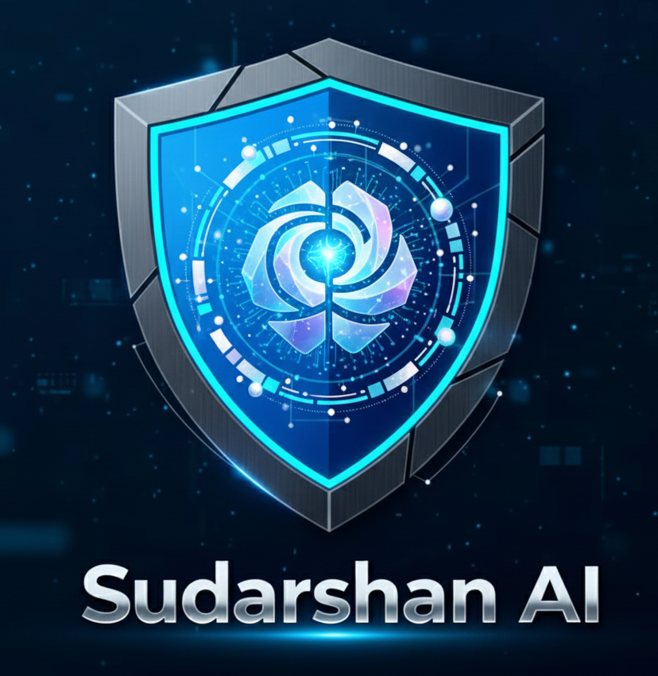

<div align="center">
  

# SUDARSHAN AI Security Scanner
Professional AI-Powered Web Application Security Testing Platform
</div>

---

## Table of Contents
- [What is SUDARSHAN?](#what-is-sudarshan)
- [Key Features](#key-features)
- [System Requirements](#system-requirements)
- [Installation](#installation)
- [How to Run](#how-to-run)
- [Usage Examples](#usage-examples)
- [Scan Modes](#scan-modes)
- [Troubleshooting](#Troubleshooting)
- [Help & Support](#help--support)
- [Legal Notice](#legal-notice)
- [Author](#author)
- [License](#license)
- [Acknowledgments](#acknowledgments)

---

# What is SUDARSHAN?

SUDARSHAN (Advanced Security Testing & Risk Assessment with Vulnerability Analysis)  
Ek AI-powered professional-grade web application security scanner hai:

- Security Engineers  
- Pentesters  
- Developers  
- Organizations  
- Students  

ke liye specially designed.

### Highlights
- AI-Powered testing using LLaMA 3.2  
- Deep vulnerability scanning  
- OWASP Top 10 2021 coverage  
- Modern GUI + CLI  
- Detailed HTML/JSON Reports  

---

# Key Features

## AI-Powered Intelligence
- LLaMA 3.2 based intelligent analysis  
- Smart exploit payload generation  
- Multi-step chain attack detection  
- Business-impact based risk scoring  
- Executive summaries  

## OWASP Top 10 Coverage
| ID | Category | Tests |
|----|----------|--------|
| A01 | Broken Access Control | IDOR, Escalation, Traversal |
| A02 | Cryptographic Failures | SSL/TLS weakness |
| A03 | Injection | SQL, NoSQL, LDAP, XXE |
| A04 | Insecure Design | Logic flaws |
| A05 | Misconfiguration | Default creds, open configs |
| A06 | Vulnerable Components | Outdated versions |
| A07 | Auth Failures | Password/session issues |
| A08 | Data Integrity | Deserialization |
| A09 | Logging | Log tampering |
| A10 | SSRF | Server-side request forgery |

## GUI Features
- Burp Suite inspired interface  
- Live vulnerability feed  
- Color-coded severity  
- Real-time console  
- HTML/JSON report export  

---

# System Requirements

## Minimum:
- Python 3.8+  
- 4GB RAM  
- Windows / Linux / macOS  
- 5GB free storage  

## Recommended:
- 8GB RAM  
- 4+ core CPU  
- 10GB storage  

## Tested Platforms:
- Kali Linux  
- Parrot OS  
- Ubuntu  
- Debian  
- Windows 10/11  
- macOS  

---

# Installation

## Quick Install

```bash
git clone https://github.com/indianhacker12/sudarshan.git
cd sudarshan
